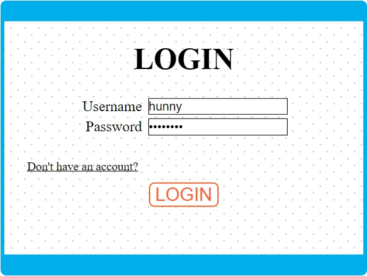
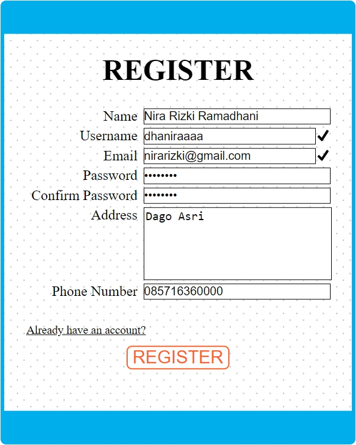
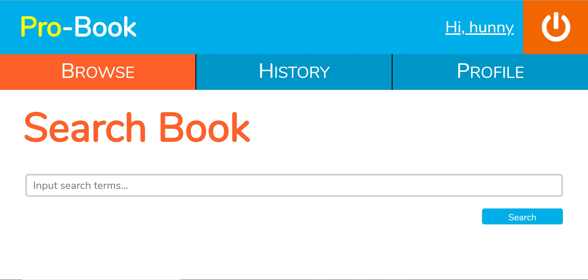
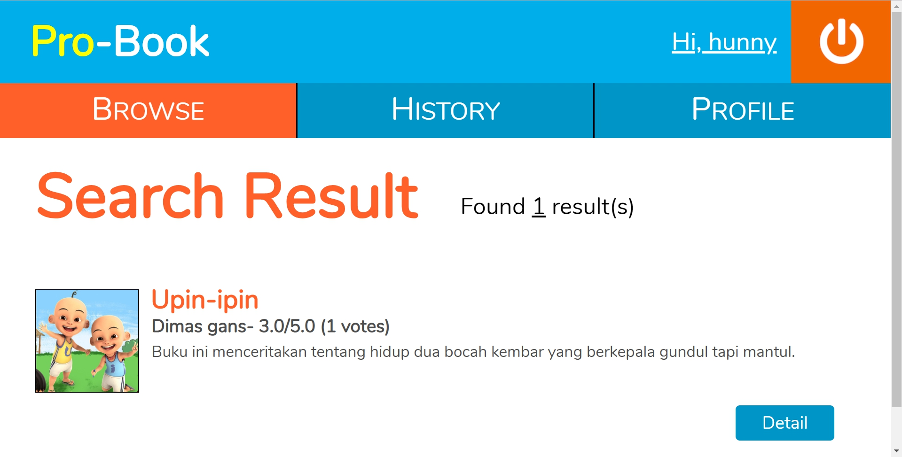
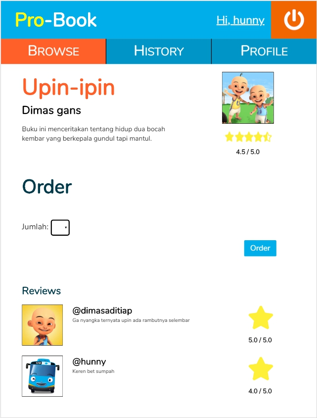
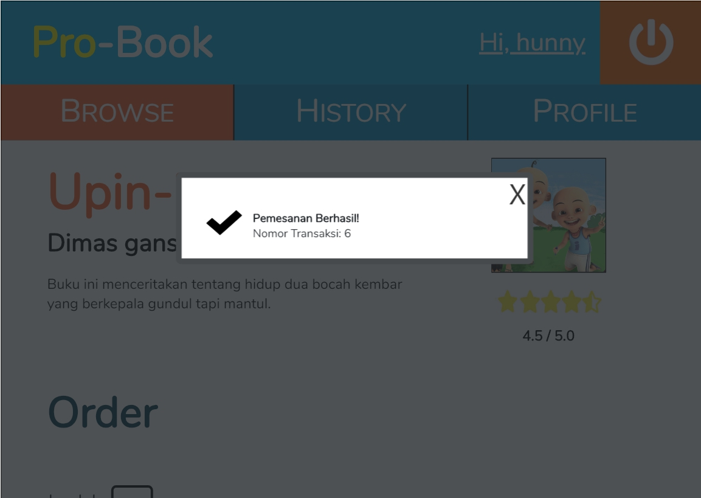
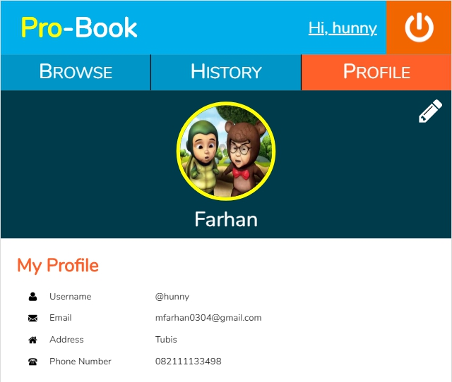
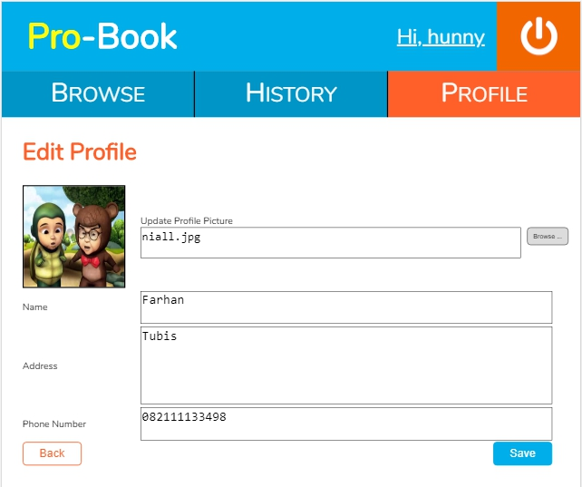
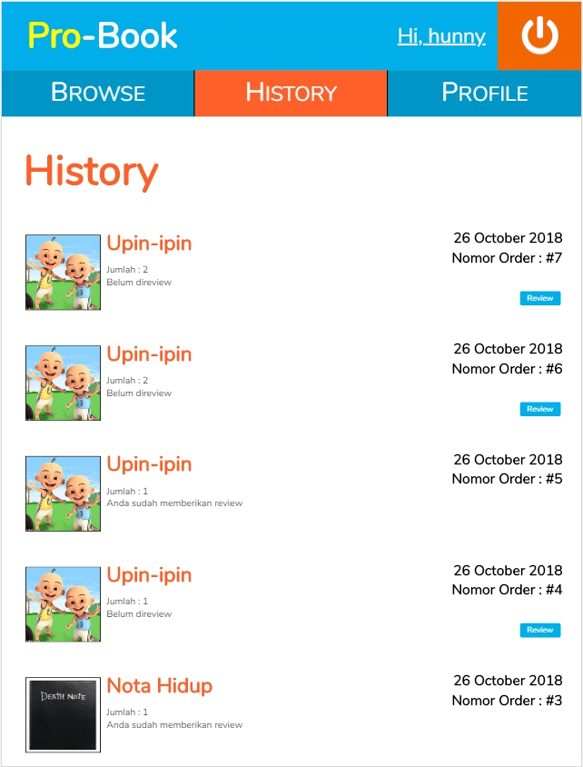
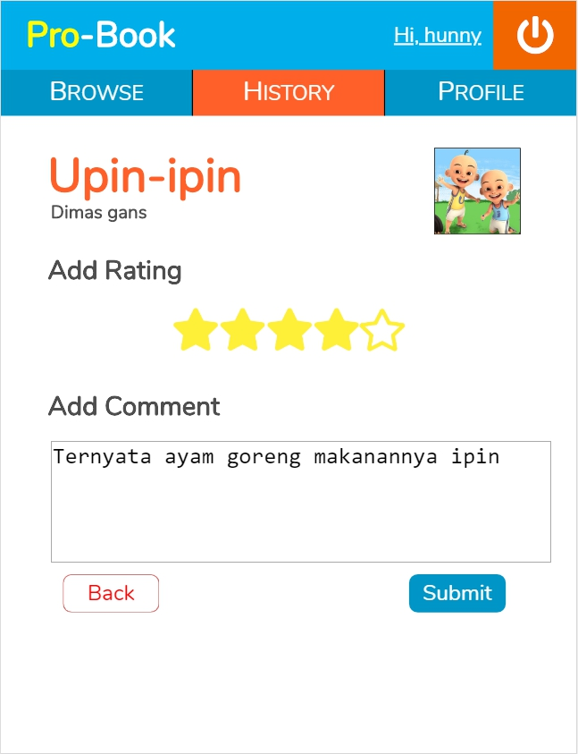

# Tugas 1 IF3110 Pengembangan Aplikasi Berbasis Web

Membuat sebuah Website Toko Buku
## Deskripsi Singkat

Probook adalah sebuah aplikasi toko buku online berbasis web yang memungkinkan seorang pengguna untuk membeli dan memberi komentar pada buku. Untuk menggunakan aplikasi ini, seorang pengguna harus melakukan login.  Pengguna juga dapat melihat riwayat pembelian buku serta menyunting profil.

## Anggota Tim

**Kelompok Barnyans - Kelas03**  
Nira Rizki Ramadhani | 13516018  
Muhammad Farhan | 13516093  
Dimas Aditia Pratikto | 13516153  

## Struktur File
mocks: mock-up aplikasi probook  
static: berisi gambar yang diperlukan  

## Dokumentasi

### Login

Pengguna dapat melakukan login sebagai user. Pengguna hanya perlu memasukkan username dan password yang sudah didaftarkan pada aplikasi ini. Apabila pengguna belum pernah membuat akun, maka pengguna harus melakukan register terlebih dahulu dengan memilih “Don’t have an account?”.

### Register

Pengguna dapat mendaftarkan diri sebagai user agar dapat menggunakan aplikasi ini. Pengguna tidak dapat mendaftarkan diri menggunakan email dan/atau username yang sudah pernah digunakan sebelumnya. Jika email dan username valid akan ditandai dengan lambang centang seperti pada gambar. Setelah mendaftarkan diri, pengguna akan secara otomatis login dengan user yang baru didaftarkannya.

### Search-Books

Setelah melakukan login, halaman utama yang akan ditampilkan adalah Search-Books. Pada halaman Search-Books, terdapat sebuah input field dapat diisi pengguna untuk melakukan pencarian buku berdasarkan judul. Setelah pengguna menekan tombol search, pengguna akan dibawa ke halaman Search-Result. Pengguna diharuskan memasukkan kata kunci tertentu, tidak dapat melakukan search tanpa memasukkan input pada input field.

### Search-Result

Pada Search-Result, ditampilkan daftar buku dan jumlah hasil pencarian. Pada tiap entri buku ditampilkan judul, penulis, gambar, potongan sinopsis, serta rating dari buku tersebut. Jika tombol detail ditekan, pengguna akan dibawa ke halaman Book-Detail dari buku yang bersangkutan.

### Book-Detail

Pada halaman ini, ditampilkan detail buku yang terdiri dari judul, penulis, gambar, rating, serta komentar dan rating dari user lain. Pada halaman ini juga disediakan dropdown untuk memasukkan jumlah buku yang ingin dipesan dan tombol order. 

Setelah proses pemesanan selesai dilakukan, akan muncul notifikasi pada browser pengguna. 

### Profile

Pada halaman ini, ditampilkan nama lengkap, username, email, alamat, nomor telepon, dan foto profil. Pada bagian kanan atas terdapat tombol edit, jika pengguna menekan tombol tersebut, pengguna dibawa ke halaman Edit-Profile.

### Edit-Profile

Pada halaman ini, pengguna dapat mengubah nama yang ditampilkan, alamat, nomor telepon, dan foto profil.
Pada bagian bawah halaman, terdapat tombol Back dan Save. Jika tombol Back ditekan, pengguna kembali ke halaman Profile tanpa mengubah informasi profilnya. Jika tombol save ditekan, nama dan alamat pengguna akan diganti sesuai input field, dan pengguna dibawa ke halaman Profile.

### History

Pada halaman ini, ditampilkan daftar buku yang sudah pernah dipesan oleh pengguna, diurutkan berdasarkan waktu pemesanan dengan pesanan paling baru merupakan entri paling atas.
Pada tiap entri pada history, terdapat tombol review. Jika tombol review ditekan, pengguna akan dibawa ke halaman Review. Jika pengguna sudah memberikan review untuk order tersebut, tombol review akan hilang dari entri yang bersangkutan.

### Review

Pada halaman ini, pengguna dapat memberikan review untuk buku yang dipesan berupa rating dan komentar. Review yang diberikan dari halaman ini akan muncul pada halaman Book-Detail dari buku yang di-review. Setelah selesai, user akan dibawa kembali ke halaman History.

### Pembagian Tugas
**Tampilan**
1. Login: 13516093
2. Register: 13516093
3. Search-Books: 13516018
4. Search-Result: 13516018
5. Book-Detail: 13516153
6. Profile: 13516093
7. Edit-Profile: 13516093
8. History: 13516153
9. Review: 13516018

**Fungsionalitas**
1. Login: 13516093
2. Register: 13516093
3. Search-Books: 13516018
4. Search-Result: 13516018
5. Book-Detail: 13516153
6. Profile: 13516093
7. Edit-Profile: 13516093
8. History: 13516153, 13516018
9. Review: 13516018, 13516153
10. Validation: 13516018, 13516093, 13516153
11. Database: 13516018, 13516093, 13516153

## About

Asisten IF3110 2018  
Audry | Erick | Holy | Kevin J. | Tasya | Veren | Vincent H.  
Dosen : Yudistira Dwi Wardhana | Riza Satria Perdana | Muhammad Zuhri Catur Candra  

